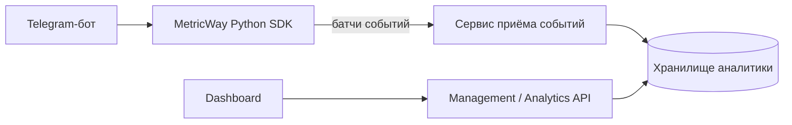

# MetricWay — архитектурный разбор

Публичный разбор архитектуры **MetricWay** — платформы продуктовой аналитики для Telegram-ботов.

Основной репозиторий приложения закрыт. В этом репозитории **нет production-кода, учётных данных, внутренних endpoint'ов, инфраструктурных секретов или пользовательских данных**. Здесь описаны архитектура системы и инженерные компромиссы на высоком уровне.

## Упрощённая архитектура

Контур приёма событий отделён от пользовательского API. Благодаря этому сбор аналитики не зависит напрямую от нагрузки dashboard'а, а оба направления можно развивать независимо под разные типы нагрузки.

## Публичный SDK

Открытый [metricway-sdk](https://github.com/urlifeceo/metricway-sdk) — асинхронная Python-библиотека для Telegram-ботов.

В SDK реализованы:

- неблокирующий сбор событий;
- ограниченная очередь в памяти;
- фоновая отправка батчей;
- повторы с backoff при временных ошибках;
- корректное завершение работы;
- опциональная интеграция с aiogram 3;
- автоматические тесты и CI.

## Инженерные решения

### Отдельный сервис приёма событий

Аналитические события приходят постоянно и создают в основном write-нагрузку, в то время как dashboard API работает в классическом request/response режиме. Отдельный ingestion-контур уменьшает связанность и позволяет независимо настраивать ограничения, надёжность и масштабирование.

### Аналитика не должна ломать основной бот

Сбой аналитики не должен останавливать бизнес-логику Telegram-бота. Поэтому SDK использует best-effort доставку и выносит сетевые запросы из обработчиков событий.

### Явные ограничения вместо бесконечных очередей

Размер очереди, батчей, число повторных попыток и время завершения ограничены. При перегрузке система ведёт себя предсказуемо и не маскирует проблему бесконечным накоплением данных.

### Хранилище под аналитическую нагрузку

MetricWay использует ClickHouse для аналитических данных. Отправка строится батчами, а не отдельным сетевым и database round trip на каждое событие.

## Подробнее

- [Архитектура системы](docs/architecture.md)
- [Приём событий](docs/event-ingestion.md)
- [Надёжность и компромиссы](docs/reliability.md)

## Стек проекта

`Python` · `asyncio` · `FastAPI` · `Go` · `Fiber` · `ClickHouse` · `Docker` · `pytest` · `GitHub Actions`

Этот репозиторий — **архитектурный case study**, а не зеркало приватного production-репозитория.
