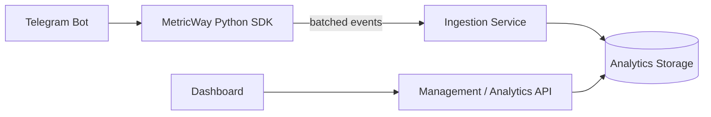

# MetricWay — Architecture Case Study

A public architecture case study for **MetricWay**, a product analytics platform for Telegram bots.

The main application repository is private. This repository intentionally contains **no production source code, credentials, internal endpoints, infrastructure secrets or customer data**. It explains the public architecture and engineering trade-offs at a high level.

## Simplified architecture

The ingestion path is deliberately separated from the product-facing API. This keeps event collection independent from dashboard traffic and lets each path evolve around a different workload.

## Public SDK

The open-source [metricway-sdk](https://github.com/urlifeceo/metricway-sdk) is an asynchronous Python library for Telegram bots.

It demonstrates:

- non-blocking event collection;
- a bounded in-memory queue;
- background batch delivery;
- retry/backoff for temporary failures;
- graceful shutdown;
- optional aiogram 3 integration;
- automated tests and CI.

## Engineering decisions

### Separate ingestion from the main API

Analytics events are write-heavy and continuous, while the dashboard API is request/response-oriented. A separate ingestion boundary reduces coupling and allows different reliability and scaling policies.

### Protect the host bot

Analytics should not break the business flow of the Telegram bot. The SDK therefore treats event delivery as best-effort and keeps network I/O outside request handlers.

### Prefer explicit limits

Queues, batches, retry attempts and shutdown waits are bounded. This makes overload behavior predictable and avoids hiding failures behind unbounded buffering.

### Keep analytics storage optimized for analytical access

MetricWay uses ClickHouse for event analytics. The ingestion design is built around batching rather than one network/database round trip per event.

## More detail

- [System architecture](docs/architecture.md)
- [Event ingestion](docs/event-ingestion.md)
- [Reliability and trade-offs](docs/reliability.md)

## Stack represented in the project

`Python` · `asyncio` · `FastAPI` · `Go` · `ClickHouse` · `Docker` · `pytest` · `GitHub Actions`

This repository is intentionally a **case study**, not a mirror of the private production repository.
