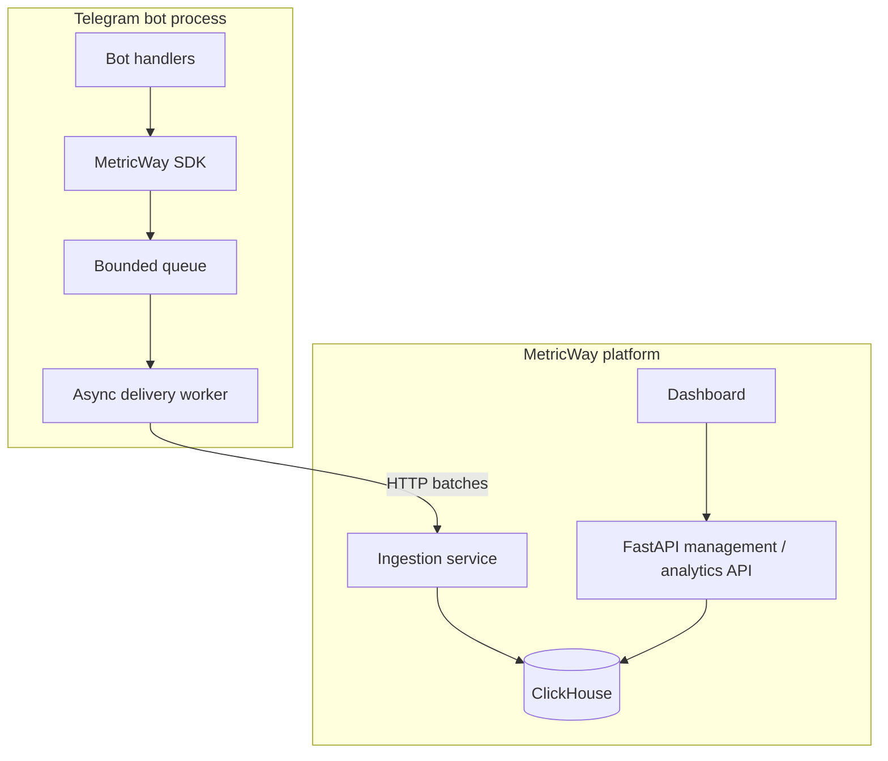

# System architecture

## Two traffic paths

MetricWay can be understood as two separate flows:

1. **event ingestion** — Telegram bot → Python SDK → ingestion service → analytics storage;
2. **product access** — dashboard/client → management API → analytics data.

## Why split ingestion from the main API?

The two workloads have different characteristics.

The ingestion path is mostly about:

- accepting events cheaply;
- handling bursts;
- retrying temporary failures;
- controlling batch size;
- protecting the producer from slow downstream dependencies.

The management API is mostly about:

- authentication;
- projects and configuration;
- analytics queries;
- dashboard-facing request/response flows.

Keeping these responsibilities separate makes the boundaries easier to reason about and gives room for independent scaling later.

## SDK boundary

The SDK deliberately does not perform a network request inside every tracked event call.

Instead, it:

1. validates and serializes the event;
2. places it into a bounded in-memory queue;
3. returns control to the bot;
4. delivers queued events in the background.

This keeps analytics instrumentation from dominating bot-handler latency.

## Storage choice

ClickHouse is used for analytics because the workload is naturally event-oriented and read through aggregations over time.

The public case study does not document private schemas or operational credentials. The important architectural property is that ingestion is batch-oriented and storage is optimized for analytical queries.

## Deployment model

The application is containerized with Docker. The public architecture focuses on service boundaries rather than production hostnames, internal ports or deployment secrets.
