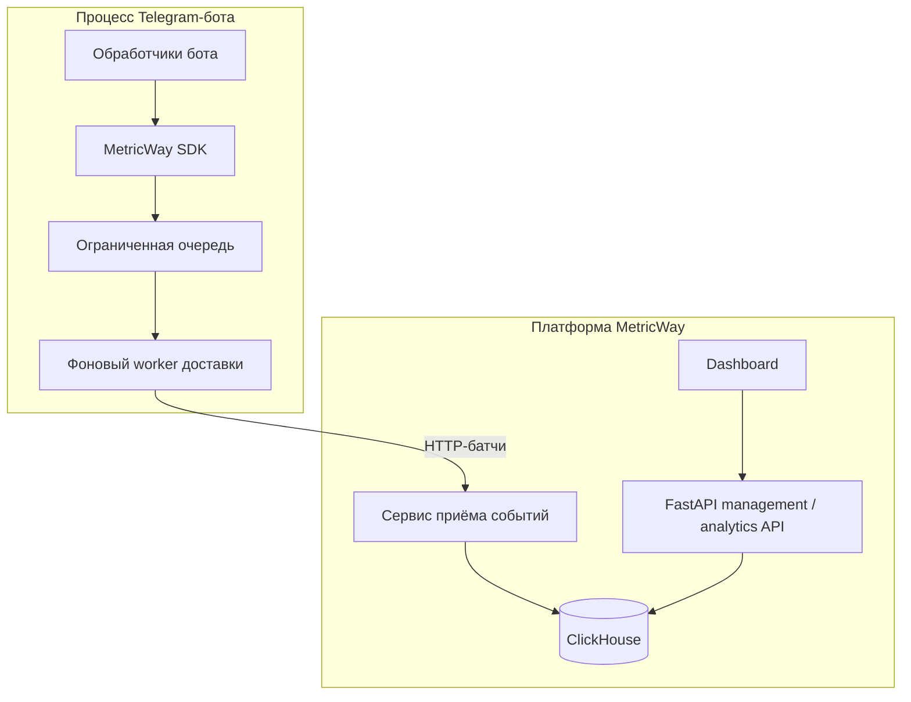

# Архитектура системы

## Два контура трафика

MetricWay можно рассматривать как два отдельных потока:

1. **приём событий** — Telegram-бот → Python SDK → сервис приёма событий → аналитическое хранилище;
2. **работа с продуктом** — dashboard/клиент → API управления → аналитические данные.

## Почему приём событий отделён от основного API?

У этих двух типов нагрузки разные характеристики.

Контур приёма событий отвечает в основном за:

- быстрый приём событий;
- обработку всплесков нагрузки;
- повторные попытки при временных сбоях;
- контроль размера батчей;
- защиту источника событий от медленных зависимостей ниже по цепочке.

API управления отвечает в основном за:

- аутентификацию;
- проекты и конфигурацию;
- аналитические запросы;
- request/response-взаимодействие с dashboard.

Разделение этих зон ответственности упрощает архитектурные границы и оставляет возможность независимо масштабировать компоненты в будущем.

## Граница ответственности SDK

SDK намеренно не выполняет сетевой запрос при каждом вызове отправки события.

Вместо этого он:

1. валидирует и сериализует событие;
2. помещает его в ограниченную очередь в памяти;
3. сразу возвращает управление боту;
4. отправляет накопленные события в фоне.

Так аналитика оказывает минимальное влияние на задержку обработчиков бота.

## Выбор хранилища

ClickHouse используется для аналитики, потому что нагрузка имеет событийный характер и предполагает агрегации данных во времени.

Публичный архитектурный разбор не содержит приватных схем и рабочих учётных данных. Главное архитектурное свойство — приём данных построен вокруг батчей, а хранилище ориентировано на аналитические запросы.

## Модель развёртывания

Приложение контейнеризовано с помощью Docker. В публичном описании акцент сделан на границах сервисов, а не на production-hostname, внутренних портах или секретах инфраструктуры.
