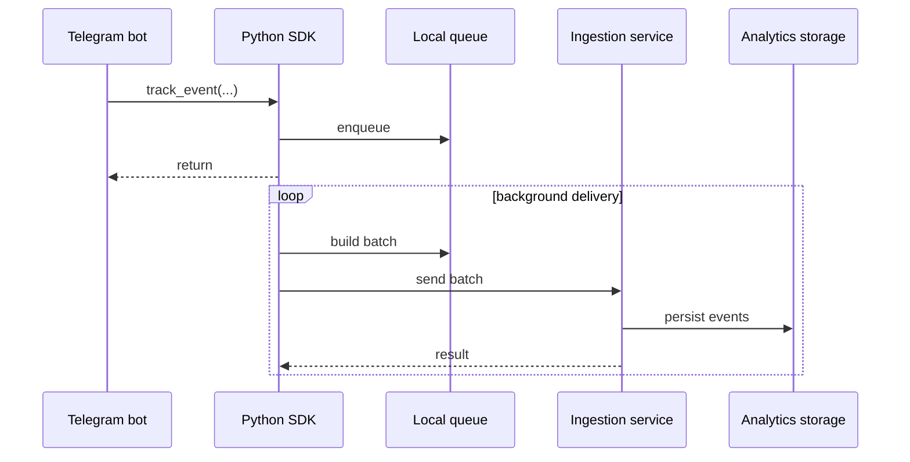

# Event ingestion

## Flow

## Batching

Sending every analytics event as its own HTTP request creates unnecessary overhead.

The SDK therefore groups records into batches before delivery. It also limits request size so a large payload cannot grow without bound.

## Retry behavior

Temporary failures are retried with backoff.

The current public SDK handles:

- network failures;
- HTTP 429 responses;
- server-side 5xx responses;
- `Retry-After` where available.

Permanent client-side errors are not retried indefinitely.

## Backpressure

The SDK uses a bounded queue.

If the producer creates events faster than they can be delivered for long enough, the queue can fill. In that case, analytics events may be dropped rather than blocking the host bot forever.

This is a deliberate trade-off:

> product availability is more important than perfect analytics completeness.

## Delivery semantics

The SDK is best-effort, not a durable message broker.

Because the queue is in memory, an abrupt process termination can lose unsent events. That limitation is documented rather than hidden behind an "exactly once" claim.

If delivery guarantees become stricter in the future, a durable local or external queue would be the natural next architectural step.
