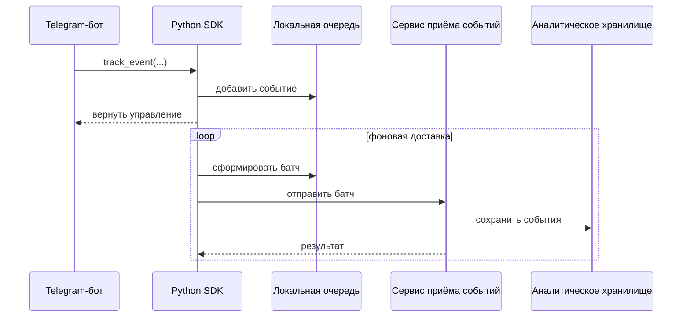

# Приём событий

## Поток данных

## Батчинг

Отправка каждого аналитического события отдельным HTTP-запросом создаёт лишние накладные расходы.

Поэтому SDK группирует записи в батчи перед отправкой. Размер запроса также ограничен, чтобы крупный payload не мог бесконтрольно увеличивать объём данных.

## Повторные попытки

Временные ошибки обрабатываются повторными попытками с backoff.

Текущий публичный SDK обрабатывает:

- сетевые ошибки;
- HTTP 429;
- серверные ошибки 5xx;
- `Retry-After`, если он передан сервером.

Постоянные клиентские ошибки не повторяются бесконечно.

## Backpressure

SDK использует ограниченную очередь.

Если источник долго создаёт события быстрее, чем система успевает их отправлять, очередь может заполниться. В этом случае отдельные аналитические события могут быть отброшены вместо бесконечной блокировки основного Telegram-бота.

Это осознанный компромисс:

> доступность основного продукта важнее абсолютной полноты аналитики.

## Семантика доставки

SDK работает по модели best-effort и не является надёжным брокером сообщений.

Так как очередь находится в памяти, при аварийном завершении процесса часть неотправленных событий может быть потеряна. Это ограничение явно документируется, а не скрывается за обещанием «exactly once».

Если в будущем требования к гарантии доставки станут строже, следующим логичным архитектурным шагом будет надёжная локальная или внешняя очередь.
